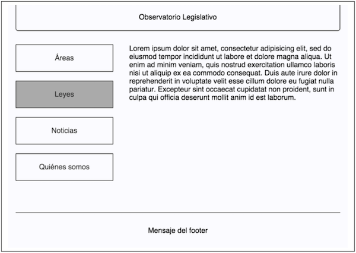

# Pauta Interrogación 2

## Ejercicio 1 (34%): Preguntas conceptuales

Responde en forma precisa y concisa las siguientes preguntas:

1. (1 pto) Explica el concepto de "especificidad" en CSS. Da un ejemplo en que ese concepto sea relevante.

  **Respuesta**: La especificidad en CSS es parte del proceso usado para determinar precedencia en los valores de propiedades cuando varias reglas, por sus selectores, aplican sobre el mismo elemento. Según esta regla, en forma simple, un estilo _inline_ será más específico, seguido de los IDs, luego las clases, pseudo clases y atributos, y finalmente los elementos. Oficialmente, la especificidad se calcula de la siguiente manera:
  * a = número de selectores ID en el selector.
  * b = número de clases, selectores de atributos, y pseudo-clases del selector.
  * c = número de selectores de tipo y pseudo-elementos en el selector.

  Luego, el número formado (suponiendo una base suficientemente grande) *a b c* entrega la especificidad.

  Ejemplo: dado el HTML `<h1 class="titulo color rojo" id="azul">Título</h1>`, y el siguiente CSS:
  ```css
  #azul {
    color: blue;
  }

  .titulo.color.rojo {
    color: red;
  }
  ```

  Entonces la palabra Título se verá de color azul, aunque tenga más clases que selectores de ID y aunque la regla correspondiente esté declarada primero que la otra.

  _Puntaje: 0.5 ptos por correcta definición, 0.5 ptos por ejemplo atingente_.

2. (1 pto) En el contexto de CSS, ¿qué es el *box model*?

  **Respuesta**: El box model es una abstracción de un elemento HTML al considerarlo como una "caja". Esta caja consiste en cuatro capas: márgen, borde, _padding_, y el contenido en sí.
  * Contenido: espacio que alberga el contenido real del elemento.
  * _Padding_: área entre el contenido y su borde.
  * Borde: límite del contenido, definido por el límite entre el margen y el _padding_ del elemento.
  * Margen: área que separa el borde del contenido con otros elementos.

  _Puntaje: 1 pto por correcta definición del modelo. No es necesario explicar qué es cada elemento, pero si al menos mencionar cada uno_.

3. (1 pto) Da un ejemplo que no tenga relación con "inicio de sesión" de una situación en que sean útiles las _HTTP cookies_. Explica cómo funcionarían las cookies en ese ejemplo.

  **Respuesta**: Un ejemplo posible podría ser el uso de _cookies_ en páginas web de aerolíneas, donde no es necesario que el usuario inicie sesión para guardar sus preferencias, y luego efectuar _revenue management_ en base a sus intereses. En este caso, la _cookie_ deberá tener una fecha de expiración definida por la aerolínea, y contener información que permita a la aplicación decidir respecto a políticas de precio para el usuario.

  _Puntaje: 0.5 ptos por un ejemplo que no involucre sesiones, y 0.5 ptos por identificar los parámetros que debe almacenar la cookie_.

4. (1 pto) Sabemos que podemos mantener sesiones en las aplicaciones Web, y esto es gracias a lo que provee el protocolo *HTTP*. Entonces, ¿por qué seguimos afirmando que el protocolo *HTTP* es _stateless_?

  **Respuesta**: Que HTTP sea _stateless_ significa que cada _request/response_ HTTP no depende del pasado ni del futuro, mas debe contener toda la información necesaria para ser procesado. En ese sentido, mantener sesiones no corresponde a guardar estados, sino a estar constantemente enviando la información necesaria para saber que el usuario está "dentro de una sesión" (_cookie_, por ejemplo), y guardando el estado en otro lugar (en el mismo cliente o en el servidor).

  _Puntaje: 0.5 ptos por la explicación respecto de HTTP, 0.5 ptos por mencionar el hecho de estar constantemente enviando información respecto al estado.

5. (1 pto) ¿Qué es una *resourceful route* en Rails y en qué consiste su soporte? Da un ejemplo si lo estimas pertinente.

  **Respuesta**: Una _resourceful route_ en Rails es un _mapping_ estándar aplicado a un recurso (*CRUD* más formularios para `create` y `update`), donde a cada una estas acciones se les asocia un método HTTP (`POST, GET, PATCH/PUT, DELETE`), un *path* y una acción en el un controlador. Esto permite declarar implícitamente las rutas para las acciones `index, show, edit, new, create, update, destroy` del controlador. Simplemente se declaran en una línea de código (por ejemplo: `resources :photos`).

  _Puntaje: 1 pto por mencionar el mapping entre los métodos HTTP y las acciones del controlador (evaluar la calidad de la respuesta según el dominio del contenido)_.

6. ¿Qué es y cómo funciona el *flash* en Rails? Pista: no tiene nada que ver con Adobe.
**Respuesta**: El método `flash` es una parte especial del manejo de sesión de Rails que consiste en un *hash* que elimina su contenido después de un siguiente _request_; o sea, cuyos valores asignados en un *request* sólo estarán disponibles para el siguiente _request_, lo que sirve generalmente para guardar mensajes de error o éxito de acciones realizadas, por ejemplo.

  Se utiliza de la misma forma que la sesión (con pares _key-value_), y se pueden almacenar valores para ser usados luego de una redirección o el procesamiento de la siguiente acción.

  _Puntaje: 0.5 ptos por mencionar que se elimina su contenidos después del siguiente request, 0.5 ptos por mencionar que funciona como la sesión, como un hash_.

## Ejercicio 2 (33%): Spyweb 3000

Estarás a cargo de una misión muy importante, si decides aceptarla (si no, tendrás un 1.0 en esta pregunta...). Debes desarrollar el punto de entrada de un nuevo software de información para agentes secretos de una importante organización global. Este sistema funcionará de la siguiente manera:

El usuario entrará al *home* y será automáticamente dirijido hacia la página del registro de visitas. Luego de completar ese formulario, será redirigido al *home*, pero esta vez se le mostrará un contenido que será diferente dependiendo de si se le reconoció como un espía o no. El formulario sólo es necesario completarlo una vez, pues luego de ello el usuario podrá cargar la página de inicio todas las veces que quiera durante algún tiempo y el *home* le seguirá mostrando ya sea el contenido para espías o el para no espías.

En concreto, la misión tuya es la siguiente:

* (1.2 ptos) Escribir la acción del controller del Home, que redirigirá a la página de registro de visitas o mostrará su template dependiendo de si ya cuenta con la información acerca de si el usuario es espía o no.

* (1.2 ptos) El template del *home*, simplemente mostrando un contenido diferente para el caso en que está siendo vista por un espía o alguien que no es espía (elige tú un contenido diferenciador, no te compliques con eso pues después lo cambiarán).

* (1.8 ptos) El template de la página de registro de visitas, que mostrará un formulario con los siguiente campos:
  * Nombre
  * Año de nacimiento
  * Páıs de origen
  * Pregunta secreta: *¿De qué color es la pata de un conejo?*


* (1.8 ptos) La acción del controller del registro de visitas que recibe los datos del formulario. Ésta debe:
  * Entregar la respuesta a la pregunta secreta al método process del servicio `SpyDetector`. No te dirán cómo funciona este servicio (de lo contrario tendría que... tú sabes...), pero lo importante es que entregará `true` si lo entregado es una respuesta de espía válida, o `false` en caso contrario. Esto te ayudará a reconocer a un espía para eventualmente saber qué información mostrarle.

  * Guardar los 3 primeros datos en el modelo `Visit`. Puedes suponer que este modelo ya existe, cuenta con validaciones y sigue las convenciones de Rails.

  * Redirigir al usuario al *home*.

Recuerda, es importante que el usuario tenga que completar el formulario una única vez, y luego de eso pueda
navegar en el *home* y otras secciones, teniendo acceso a la información que le corresponda.

### Solución

Una posible solución se encuentra en el directorio [`p2`](p2).

## Ejercicio 3 (33%): El Observatorio Anticorrupción

Recientemente se anunción la creación del "Observatorio Anticorrupción" que
promete ofrecer un fácil monitoreo del grado de avance de cada uno de los temas
de la agenda de probidad creada por el Consejo Anticorrupción.

Como saben que te estás volviendo todo un experto en HTML y CSS, te han pedido
tu ayuda con el código HTML y CSS del home, para el cual tienen el siguiente
diseño:



Considera que para ellos es importante que esto sea un buen trabajo del punto
de vista tecnológico, por lo tanto es relevante que eligas los elementos HTML y
CSS más adecuandos para cumplir el objetivo. No te preocupes por el texto de la
página. Puedes usar "[…]" o algún otro *placeholder*.

### Solución y Pauta

Una posible solución se encuentra en el directorio [`p3`](p3).

La evaluación es de acuerdo a la siguiente rúbrica:

<table>
 <tr><td dir="ltr" rowspan="2">Similitud</td><td>0</td><td dir="ltr">10</td><td dir="ltr">26</td><td dir="ltr">36</td></tr><tr><td dir="ltr">El resultado no tiene la disposición de los elementos de forma correcta (columnas), los bordes no están donde deben estar, las esquinas no son redondeadas, la disposición de los enlaces no es correcta ni se incluye la interacción del usuario. </td><td dir="ltr">El resultado es similar, salvo más de algún error en márgenes, rellenos, bordes (bordes no redondeados y fuera de lugar), interacción del usuario faltante e incorrecta disposición de los elementos (columnas)</td><td dir="ltr">El resultado muy parecido, salvo algunos márgenes, rellenos, bordes (bordes no redondeados y fuera de lugar) o interacción del usuario faltante.</td><td dir="ltr">El resultado se ve igual o muy parecido, salvo algunos márgenes, rellenos o anchos</td></tr><tr><td colspan="5">HTML</td></tr><tr><td rowspan="2">Estructura completa y correcta</td><td>0</td><td>4</td><td>15</td><td>20</td></tr><tr><td>No cumple con la estructura mínima y contiene errores graves: no conoce la sintaxis ni nombres de etiquetas, no incluye atributos correspondientes a los elementos, elementos mal anidados, etc.</td><td>No cumple con la estructura mínima y contiene errores importantes (incluye body dentro del head o vice versa, incluye etiquetas que van dentro del body afuera de éste o no comprende el concepto de anidar elementos).</td><td>Cumple con la estructura mínima de forma casi completa, pero contiene errores como no incluir la etiqueta head, no incluir el elemento raiz html o utilizar rails para generar etiquetas.</td><td>Cumple con la estructura mínima completa, puede contener pequeños errores (etiquetas con nombre incorrecto, no linkea la hoja de estilos, no incluye doctype, etc.)</td></tr><tr><td rowspan="2">Uso semántico de etiquetas</td><td>0</td><td>5</td><td>9</td><td>12</td></tr><tr><td>No utiliza etiquetas semánticamente correctas (header, nav, footer), ni etiqueta de texto de encabezado o una lista de enlaces en la navegación. El código está basado casi únicamente en divs</td><td>Utiliza sólo algunas etiquetas semánticamente correctas (header, nav, footer), una etiqueta de texto de encabezado o una lista de enlaces en la navegación. Denota falta de uso de algunas etiquetas en lugares claramente correspondientes.</td><td dir="ltr">Utiliza casi en totatilidad etiquetas semánticamente correctas: header, nav, footer, utiliza una etiqueta de texto de encabezado y una lista de enlaces en la navegación.<br>Pero tiene errores como la ausencia de una o dos de ellas.</td><td>Utiliza etiquetas semánticamente correctas: header, nav, footer.<br>Utiliza una etiqueta de texto de encabezado y una lista de enlaces en la navegación.<br>Puede contener detalles menores (no tener párrafos en el contenido, por ejemplo)</td></tr><tr><td colspan="5">CSS</td></tr><tr><td rowspan="2">Layout</td><td>0</td><td>7</td><td>15</td><td>20</td></tr><tr><td dir="ltr">No utiliza técnica de posicionamiento o mezcla de manera incoherente distintas aproximaciones, sin lograr acercarse al esquema.</td><td>Utiliza técnicas mezcladas de posicionamiento y aplica reglas a los elementos que hacen posible lograr un resultado o acercarse a este.</td><td>Utiliza con claridad una sola técnica de posicionamiento: asigna reglas a los elementos de forma correcta para lograr el resultado. Pero contiene errores que hacen que el posicionamiento no sea posible.</td><td>Utiliza con claridad una sola técnica de posicionamiento: asigna reglas a los elementos de forma correcta para lograr el resultado. Puede contener errores menores (agrega reglas que no deberían estar, pero no afectan el layout)</td></tr><tr><td rowspan="2">Selectores y propiedades</td><td>0</td><td>5</td><td>9</td><td>12</td></tr><tr><td>No utiliza selectores de forma correcta, desconoce la sintaxis.</td><td>Utiliza algunos selectores de forma correcta (ids, clases, elementos, combinaciones de los anteriores, descendencia, etc). No agrupa selectores para propiedades en común y no usa cascada de propiedades, repitiendo estilos en la hoja.</td><td>Utiliza selectores de forma correcta (ids, clases, elementos, combinaciones de los anteriores, descendencia, etc). Pero no agrupa selectores para propiedades en común y/o no usa cascada de propiedades, repitiendo estilos en la hoja.</td><td>Utiliza selectores de forma correcta (ids, clases, elementos, combinaciones de los anteriores, descendencia, etc). Agrupa selectores para propiedades en común y usa cascada de propiedades.</td></tr><tr><td></td><td></td><td></td><td dir="ltr">Total</td><td>100</td></tr></table>
